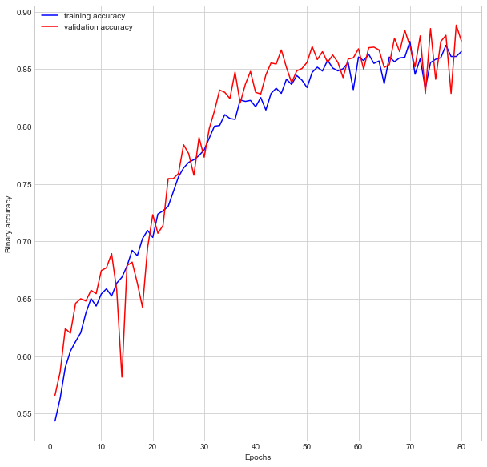
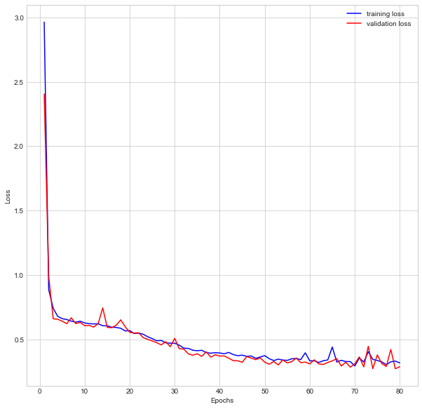

# Car or Truck?

This is a well-known classification problem in the Kaggle deep learning course example. I'm going to use convolutional neural network to build a deep learning model in Python Tensorflow to help classify the sample [car-or-truck dataset](https://www.kaggle.com/datasets/ryanholbrook/car-or-truck) without using pre-trained models.

## Load image Dataset
This dataset has been split into training and validation files. In both files, they are manually classified into cars and trucks. It is very common that people just use the training and validation dataset separately. However, this isn't a good solution because the feature of a car/truck is obviously way more than the number of pictures in this dataset. So I'm going to merge those files and randomly split them in the training phase. There are actually two ways to load image data:
  * use `imread` in `cv2` package, or
  * use `load_img` and `img_to_array` in `Keras`. 
 
Both of them should give same results. Shuffle the data and double check the shape of image to see if they are correct. Here I use image size as (128, 128) and RGB color mode. Hence the final shape of data should be: (total number of pictures, 128, 128, 3). If not, reshape is needed. In my case, I have 10168 images in total, and about 57% of them are cars.

## Build CNN model
Before constructing the CNN, I aslo use data augmentations to help generating fake data by rotation, flipping and adjusting contrast. The CNN model itself consists of three layers before flatterned. Each layer has:
 * Batch Normalization, 
 * doubled number of filters compared to the former layer, starting with 64 filters, which means 64, 128, 256 in each layers,
 * kernel size of (5, 5),
 * No padding,
 * stride = 1,
 * Activation function `Relu`,
 * Max pooling layer.

After constructing the model, it will be fitted using the data with a training-validation split as 0.2 in 80 epochs.

## Results
Here I plot the training and validation results as binary accuracy and loss (binary cross entropy). First of all, the accuracy of training vs. validation:

Also, the loss of training vs. validation:

Both validation loss and accuracy are close to those values of training, and even slightly higher, which means our model is not underfitting. The best score of accuracy in the validation is 88.84%, with also the best score of loss 0.2708. There is also no sign of overfitting in this case, which might show a decrease of validation score when training score increases after a certain epoch. 
